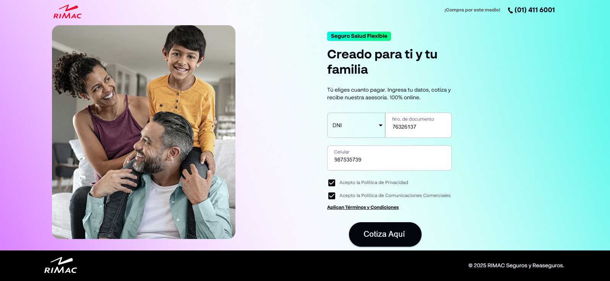

# 🚀 RIMAC Web App – Frontend Challenge

Aplicación desarrollada con **React** y **TypeScript**, siguiendo una estructura modular basada en características (*feature-based*). El objetivo es demostrar habilidades de implementación visual, validación de formularios, consumo de API y arquitectura escalable.

Puedes interactuar libremente con el formulario. Los campos están validados según las reglas de negocio, y al enviarlo se realiza una solicitud a:

```
https://rimac-front-end-challenge.netlify.app/api/user.json
```

### Ejemplo visual:


### Ejemplo visual Moviles:


---

## 🧱 Stack Tecnológico

El proyecto está construido sobre un conjunto de herramientas modernas enfocadas en rendimiento, buenas prácticas y facilidad de mantenimiento:

### 📦 Dependencias principales

| Herramienta | Funcionalidad |
|-------------|---------------|
| **@emotion/react & @emotion/styled** | Estilos dinámicos integrados con MUI |
| **@mui/material & @mui/icons-material** | Componentes UI listos para usar |
| **axios** | Cliente HTTP sencillo y eficiente |
| **react-hook-form** | Manejo eficiente de formularios |
| **yup** | Validación de formularios basada en esquemas |
| **zustand** | Gestión global de estado ligera |
| **sass** | Estilización escalable con BEM y variables |
| **react-router-dom** | Navegación y control de rutas |
| **date-fns** | Utilidades para fechas y cálculo de edad |

### 🧰 Herramientas de desarrollo

| Herramienta | Uso |
|------------|-----|
| **typescript** | Tipado estático para mayor robustez |
| **vite + @vitejs/plugin-react** | Entorno de desarrollo ágil y moderno |
| **eslint + @typescript-eslint** | Linter para mantener un código limpio |

---

## 📁 Estructura del Proyecto

El código está organizado por funcionalidades. Cada *feature* contiene sus propios componentes, estilos, lógica y pruebas. Esto favorece la escalabilidad, la legibilidad y la colaboración en equipos.

### Ventajas clave:

- Aislación de responsabilidades por módulo
- Reducción de dependencias cruzadas innecesarias
- Desarrollo simultáneo sin conflictos
- Reutilización de componentes y lógica específica

---

## 🧩 Implementación por Etapas

1. **Diseño inicial**  
   - Se configuraron fuentes y estilos base globales según el diseño de Figma.  
   - Se estructuró el layout general reutilizable para formularios y páginas.

2. **Carga de recursos**  
   - Se integraron íconos y assets siguiendo criterios de optimización.  
   - Se usó Material UI para mantener coherencia visual.

3. **Desarrollo funcional**  
   - Implementación modular de características como el formulario, validación y envío de datos.  
   - Gestión del estado y control de flujo entre vistas.

---

## ⚙️ Comandos del Proyecto

### Instalar dependencias

```bash
nvm use 22
npm install
```

### Ejecutar entorno de desarrollo

```bash
npm run dev
```

### Generar versión de producción

```bash
npm run build
```

### Levantar build localmente

```bash
serve -s dist -l 3000
```